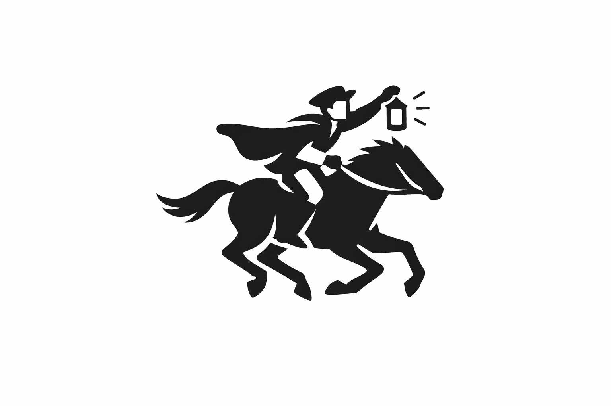

# Revere

Revere is a Chrome extension that monitors website changes live by sending a push notification to your phone within seconds. It's designed for pages that update while you're already logged in or watching the tab, which includes:
- Sports Feeds
- Breaking News Pages
- Marketplaces
- other live dashboards (like college attendance websites).
 


## What It Does

- Monitors open tabs for meaningful visible changes
- Detects live DOM updates, websocket-driven updates, and event-stream activity
- Takes low-resolution screenshot samples of armed tabs and detects visual differences
- Can use Chrome debugger capture to watch inactive armed tabs without switching tabs
- Sends alerts through a local bridge to services like `ntfy`
- Accepts agent-attention events through the bridge so background agents can ask for you
- Works well for logged-in pages and other sites where browser context matters

## Why Chrome Extension

This is a Chrome extension because that is the most practical way to access logged-in websites and monitor live page changes inside an open tab.

## Detection Model

The script runs inside the watched page and uses:

1. `MutationObserver` for live DOM changes
2. a page-context hook for `WebSocket` and `EventSource` messages
3. a fallback snapshot pass that re-scans the page for meaningful visible text every few seconds
4. a background visual scanner that compares downsampled screenshots for armed tabs

For active tabs, Revere can use `chrome.tabs.captureVisibleTab`. For inactive armed tabs, Revere can use the Chrome debugger API and CDP `Page.captureScreenshot`, which is why the extension asks for the `debugger` permission.

## Tech Stack

- Chrome Extension APIs
- JavaScript
- Node.js for the optional local bridge
- `ntfy`
- AppKit menu-bar companion for macOS screen watch and recording controls
- `ffmpeg` for local screen and camera overlay recording

## How To Run

1. Open Chrome extensions and enable Developer mode.
2. Click `Load unpacked` and select this project folder.
3. Run the local bridge if you want phone push delivery:

```bash
npm install
npm run bridge
```

4. Set the extension webhook URL to `http://localhost:8787/event`.

## Mac Menu-Bar App

Build the native companion:

```bash
./scripts/build-revere-menubar.sh
open build/Revere.app
```

Install the native companion into `/Applications`:

```bash
./scripts/install-revere-menubar.sh
```

Optionally make it open at login:

```bash
./scripts/install-revere-menubar.sh --login
```

Run the menu-bar click-through verifier:

```bash
./scripts/verify-revere-menubar.sh
```

By default, the verifier is screen-safe: it builds, signs, installs, and checks the app bundle without clicking your menu bar, focusing apps, or taking desktop screenshots. `npm run check` also verifies the extension visual-diff logic with synthetic samples, including the tiny 128x72 grayscale sample size, edge-strip noise filtering, capturable URL guards, and notification template rendering.

After granting Screen Recording permission, preserve that installed app identity:

```bash
./scripts/verify-revere-menubar.sh --no-build
```

Foreground menu-bar click-through is opt-in only:

```bash
./scripts/verify-revere-menubar.sh --no-build --foreground-ui
```

When Screen Recording is granted and foreground access is explicitly allowed, the verifier also starts/stops `Start Visual Watch` and checks that samples are captured. When Camera is already granted too, it runs the 3-second screen+face and face-only recording tests without triggering a new permission prompt.

To also verify that the mirror preference survives relaunch:

```bash
./scripts/verify-revere-menubar.sh --no-build --test-mirror-persistence
```

Mirror persistence click-through also requires `--foreground-ui`.

The app shows a white template version of the Revere rider icon in the macOS menu bar. It includes:

- `Start Visual Watch`: samples the visible desktop every 2 seconds and keeps only a tiny grayscale sample in memory.
- `Test Capture Once`: proves the native desktop sampler can read pixels without starting continuous watch.
- `Test Diff Engine`: checks the visual-diff logic with synthetic samples even before Screen Recording permission is granted.
- `Notify on Changes`: sends a throttled macOS notification when visual watch detects a meaningful screen change.
- `Start Screen Recording`: records the screen to `~/Movies/Revere`.
- `Start Screen + Face`: records the screen with a camera overlay.
- `Record 3s Screen Test` and `Record 3s Screen + Face Test`: run short auto-stopped recordings for quick verification after permissions are granted.
- `Request Camera Permission` and `Record 3s Face Test`: verify camera access and mirrored camera output independently from screen capture.
- `Test Recording Plan`: dry-runs the screen, screen+face overlay, camera, ffmpeg, and mirror-filter wiring before privacy-gated recording starts.
- `Mirror Face Overlay`: horizontally flips the camera overlay so it behaves like a mirror, and persists across launches.
- `Refresh Devices`: re-detects the AVFoundation screen and camera devices.
- `Write Diagnostics Report`: writes a local report to `~/Library/Logs/Revere/diagnostics.txt`.
- `Run Self-Test`: checks diff logic, capture availability, devices, ffmpeg, recording plan, notification state, and mirror state from the menu.
- `Launch at Login`: toggles the Revere LaunchAgent so the menu-bar app can start with macOS.
- `Open Screen Recording Settings`, `Open Camera Settings`, `Request Notification Permission`, and `Retest Permissions`: make macOS capture and alert permissions visible and recoverable from the menu-bar app.

macOS must grant Screen Recording permission before visual watch and recordings can capture pixels. Camera permission is needed before face overlay capture can work. The menu-bar app preflights those permissions, reports the permission state instead of creating empty recordings, and includes short self-tests for capture and recording.

Optional bridge hooks:

```bash
curl -X POST http://localhost:8787/agent-attention \
  -H 'Content-Type: application/json' \
  -d '{"agent":"Codex","summary":"Review the agent output and choose the next task."}'
```

```bash
REVERE_SCREEN_WATCH=1 BRIDGE_MODE=ntfy NTFY_TOPIC=your-topic npm run bridge
```

The screen watcher is off by default because macOS may require Screen Recording permission.

## How To Use It

1. Open the website you want to monitor.
2. Log in if needed.
3. Click the extension icon and open Revere.
4. Press `Start Monitoring`.
5. Keep the tab open.
6. You can work in other apps or other websites, and as long as the watched tab stays open with tracking enabled, you will keep getting live alerts.

## Learnings

This is the first product that I had to test in real time, and it failed the first two times when I was trying to track a live attendance website. Then I learned every website is different, and some are much harder to track than others. Hence I added the three-layer checker, although I hypothesize that there will need to be more layers to check.

## Task Artifact

- Current task: CodexBar-inspired visual monitoring and attention notifications.
- Artifact ID: `docs/codexbar-research.md`
- Status: syntax checked; native menu-bar controls, recording-plan dry run, permission shortcuts, and permission-gated self-tests click-through tested; Chrome manual verification and macOS Screen Recording permission re-test pending
